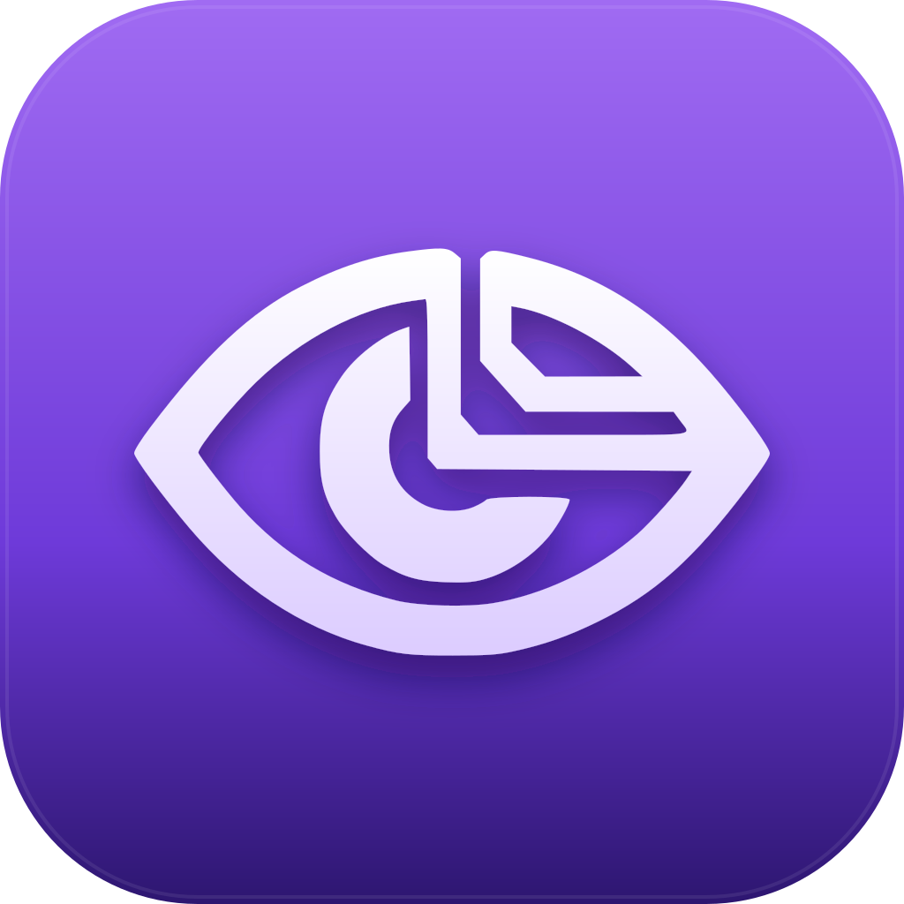

<div align="center">
  

# DevSenses

**Tu deixou IA escrever. Deixa o DevSenses te ensinar o que ela fez.**

App desktop que lê o diff do teu repo e te explica cada mudança no teu nível, com tom configurável, quiz adaptativo, glossário pessoal, modo Socrático, what-if, caça ao bug e detecção de autoria IA.

100% local. API key tua. Open source. PT-BR first.

[Download (mac)](#-instalar) · [Como funciona](#-como-funciona) · [Features](FEATURES.md) · [Roadmap](MVP_PLAN.md)

</div>

---

## ⚡ Quickstart

```bash
git clone https://github.com/Luccas-carvalho/DevSenses.git
cd DevSenses
npm install
npm run dev
```

Faz onboarding (calibra seniority + IA + tom). Aponta um repositório git. Edita um arquivo (ou deixa Cursor/Copilot fazer). Clica **Explicar**. Pronto — IA lê o diff inteiro e te ensina linha por linha.

Build de produção (.dmg em mac):
```bash
npm run build:mac:arm64
# Saída em release/devsenses-X.X.X.dmg
```

## 🧠 Como funciona

1. **Tu edita código** (manual, Cursor, Copilot, Claude Code, qualquer ferramenta)
2. **DevSenses lê o git diff** completo — uncommitted, committed, ou tudo
3. **IA explica** no nível que tu setou (Pra criança → Profundo) com tom escolhido (Mentor / Pragmático / Sarcástico / Acadêmico)
4. **Aprendizado adaptativo**: quiz pós-explicação, mastery por conceito (4 níveis), conceitos dominados saem dos próximos quizzes automaticamente
5. **Power tools**: ⌘K cheat sheet de qualquer trecho, badges de complexidade Big-O automáticos, what-if pra comparar approaches, caça ao bug pra praticar revisão

## ✨ Features principais

- 🎯 **5 níveis de profundidade** — Pra criança / Resumido / Equilibrado / Detalhado / Profundo
- 🎭 **5 personas de tutor** — Padrão / Mentor amigo / Pragmático / Sarcástico / Acadêmico
- 🧠 **Quiz adaptativo** — IA só pergunta sobre o que tu ainda não dominou
- 📚 **Glossário pessoal** — termos técnicos clicáveis no markdown, definição cacheada
- 🤔 **Modo Socrático** — IA pergunta antes de responder, força tu a pensar
- ⚡ **⌘K cheat sheet** — seleciona código, gera cheat sheet (sintaxe / gotchas / exemplos)
- 📊 **Big-O automático** — flags loops aninhados, find-in-loop, recursão sem memo
- 💡 **What-if** — "e se tivesse feito X?" — IA compara trade-offs com tabela
- 🐛 **Caça ao bug** — IA injeta bug sutil pra tu treinar code review
- 🤖 **Detecção autoria IA** — heurística com 8 sinais, score 0-100, flag visível
- 🌌 **Cosmic vibe** — galaxy loading, cosmic transition pós-onboarding, auroras

Lista completa em [FEATURES.md](FEATURES.md).

## 🎯 Pra quem

- **Junior aprendendo** — quer entender o que tua IA escreveu antes de aprovar PR
- **Mid querendo virar senior** — explicação calibrada pelo teu nível, sobe profundidade quando dominar conceito
- **Senior sem tempo** — leitura rápida de diffs grandes feitos por agentes IA, com flags automáticos pra complexidade ruim

## 🔌 Providers suportados

- **Claude Code** (CLI) — `claude`
- **Codex** (CLI) — `codex`
- **Gemini** (CLI) — `gemini`
- **Aider** (CLI) — `aider`
- **Ollama** (local) — `ollama`

DevSenses detecta automaticamente o que tu tem instalado no PATH durante onboarding. Tudo BYOK (Bring Your Own Key) — DevSenses não cobra IA.

## 🛠 Stack

- Electron 39 + electron-vite
- React 19 + TypeScript + Tailwind v4
- better-sqlite3 (migrations embedded, schema versionado v1-v9)
- Zustand (state) + SWR-like patterns
- Lucide icons (zero emoji em UI)

## 📥 Instalar

### Mac (Apple Silicon)

Baixe `.dmg` da [última release](https://github.com/Luccas-carvalho/DevSenses/releases). Arrasta pra Applications.

> Primeira execução pode mostrar aviso "app não verificado" — clica direito → Open. (Code signing em andamento.)

### Outros

Build da source até termos releases públicas:

```bash
git clone https://github.com/Luccas-carvalho/DevSenses.git
cd DevSenses
npm install
npm run build:mac      # mac
npm run build:win      # windows (.exe NSIS)
npm run build:linux    # linux (.AppImage)
```

## 📚 Documentação

- [`FEATURES.md`](FEATURES.md) — checklist completa de tudo que tem (✅ entregue / ⏳ backlog).
- [`MVP_PLAN.md`](MVP_PLAN.md) — sprints 1-4 com estimativas.
- [`SPRINT_1_PLAN.md`](SPRINT_1_PLAN.md) — detalhe técnico do sprint 1.
- [`COMMANDS.md`](COMMANDS.md) — comandos úteis (build dmg, dev, regenerate icon).
- [`CLAUDE.md`](CLAUDE.md) — instruções pro Claude Code (autoria contínua).

## 🎤 Pitch

> Cursor / Copilot / Claude Code já escrevem código por você.
> O problema agora é: **você está aprendendo, ou só aprovando o que IA cuspiu?**
>
> DevSenses é o tutor que vê o diff que tua IA fez, te explica no teu nível, te testa com quiz que aprende com tuas respostas, e marca conceitos como dominados depois de N acertos seguidos.
>
> Não é mais um chat com IA. É um sistema de aprendizado contínuo em cima do código real do teu projeto.

## 🤝 Contribuir

PRs welcome. Issues também — especialmente bug reports com diff que reproduz o problema. Stack/setup explicado em `CLAUDE.md`.

## 📜 Licença

MIT.

---

<div align="center">
<sub>Made in 🇧🇷 by <a href="https://github.com/Luccas-carvalho">Luccas Carvalho</a></sub>
</div>
